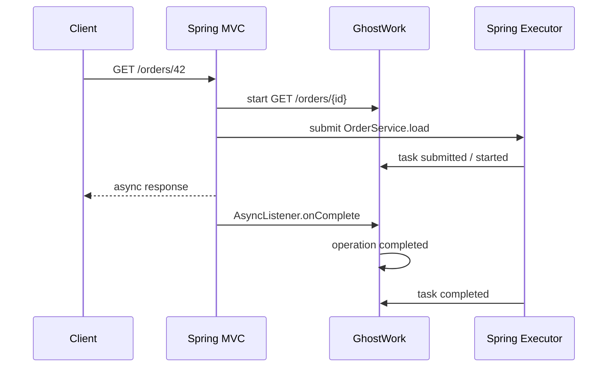

# GhostWork Spring Web MVC

[](https://github.com/nikitoo0os/ghostwork-spring-webmvc/actions/workflows/ci.yml)
[](https://central.sonatype.com/artifact/io.github.nikitoo0os/ghostwork-spring-webmvc)
[](https://adoptium.net/)
[](LICENSE)

Automatic HTTP request lifecycle tracking for GhostWork and Spring MVC.

## Compatibility

| Web MVC integration | GhostWork | GhostWork Spring | Spring Boot | Java |
| --- | --- | --- | --- | --- |
| `0.6.x` | `0.6.x` | `0.6.x` | `3.4.x` | `21+` |

## Installation

```xml
<dependency>
    <groupId>io.github.nikitoo0os</groupId>
    <artifactId>ghostwork-spring-webmvc</artifactId>
    <version>0.6.0</version>
</dependency>
```

Provide the normal `GhostWork` bean. The Web MVC module transitively includes
`ghostwork-spring`, so executor and `@Async` instrumentation are available too.

```java
@Bean
GhostWork ghostWork() {
    return GhostWork.create(Executors.newFixedThreadPool(8));
}
```

No controller annotation, filter, or manual operation wrapper is required.

## Automatic HTTP Request Tracking

```java
@RestController
public class OrderController {

    @GetMapping("/orders/{id}")
    public DeferredResult<Order> order(@PathVariable long id) {
        DeferredResult<Order> result = new DeferredResult<>();
        orderService.load(id).thenAccept(result::setResult);
        return result;
    }
}
```

GhostWork produces:

```text
Operation: GET /orders/{id}
|- Task: OrderService.load
|- HTTP response completed
`- Tasks outlived HTTP request (when applicable)
```

The URI template is used instead of the concrete URI to avoid high-cardinality
operation names.




## Supported Lifecycles

The integration uses `HandlerInterceptor` and Servlet `AsyncListener`, without
polling. It supports synchronous controllers, `DeferredResult`, `Callable`,
`WebAsyncTask`, `StreamingResponseBody`, and `SseEmitter`. Repeated
`startAsync()` registers the same lifecycle listener on the new async context.

Terminal request states are:

* `COMPLETED`
* `FAILED`
* `TIMED_OUT`
* `ABORTED` for servlet errors caused by an `IOException` or client disconnect

Client abort does not cancel child tasks.

## Request Metadata

Each operation exposes immutable `RequestMetadata` containing the HTTP method,
URI template, remote address, optional query string, request/session/principal
identifiers, timestamps, duration, response status, and async flag.

## Configuration

```yaml
ghostwork:
  web:
    enabled: true
    include-query-string: false
    request-id-header: X-Request-ID
    include: []
    exclude:
      - /actuator/**
      - /swagger-ui/**
      - /v3/api-docs/**
      - /favicon.ico
```

Provide a custom `OperationNameResolver` bean to replace the default
`HTTP_METHOD + URI_TEMPLATE` naming.

## Scope

Version `0.6.x` is Servlet/Spring MVC only. It does not add WebFlux, Reactor,
scheduled executor tracking, messaging integrations, metrics, tracing,
persistence, or distributed storage.

## License

Apache License, Version 2.0.
